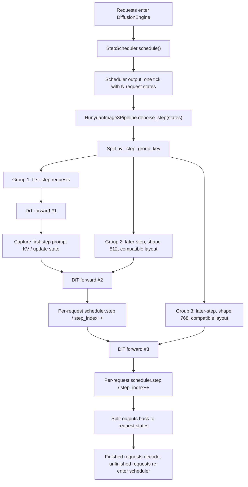
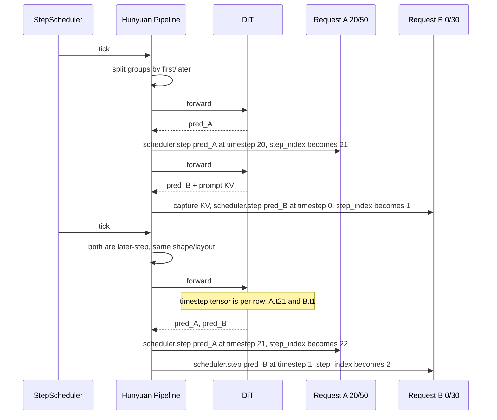
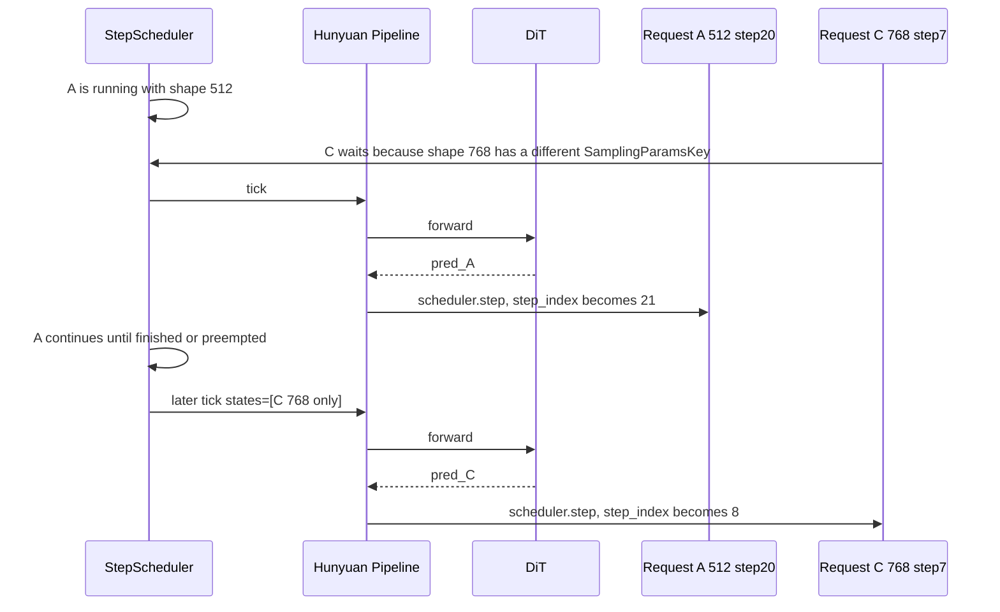

# HunyuanImage3 Grouped DiT 最新流程图与讲稿

> 口径日期：2026-06-11
> 主题：HunyuanImage3 step execution / grouped DiT batching / #4041 FA mask-plan 改造讨论
> 核心边界：同一 scheduler tick 不等于同一个 DiT forward；pipeline split 出来的多个 group 是串行 forward。

## 一句话结论

HunyuanImage3 的 grouped DiT 执行分三层：

1. **Scheduler tick**：一次调度可以带出多个 request。
2. **Pipeline step group**：Hunyuan 按 first/later、latent shape、CFG、image token layout 等条件把 request 再分组。
3. **DiT forward**：每个 step group 才对应一次 DiT forward；多个 group 在同一个 worker 内按顺序串行执行。

当前合理边界是：

- **不同 shape**：不能进同一个 DiT forward，会拆成多个 group 串行跑。
- **first step 和 later step**：不能进同一个 DiT forward，会拆组串行跑。
- **不同 later step**：在 same shape / compatible layout 下应该进同一个 DiT forward，timestep 和 scheduler update 都是 per request。

## 流程图



注意：图里的 `forward #1/#2/#3` 是**串行**，不是并行。它们只是来自同一个 scheduler tick。

## 时序图：20/50 老请求 + 0/30 新请求

场景：

- A：老请求，512x512，当前 `step_index=20/50`，下一步是 later step 20。
- B：新请求，512x512，当前 `step_index=0/30`，下一步是 first step 0。
- A/B 的 `SamplingParamsKey` 必须相同，尤其是 `height/width/resolution/CFG/LoRA` 兼容；否则 B 不会在 A running 时被 scheduler 放进同一个 tick。
- 图里的 forward 顺序来自当前 states/group insertion order，不是语义承诺。关键点是 first/later 会拆成两个 group，两个 group 串行 forward。



解释：

- tick #1 里 A 和 B 同时被 scheduler 带出，但 first/later 不兼容，所以 pipeline 内部拆成两个 group，串行跑两个 forward。
- tick #2 起，B 已经完成 first step，A/B 都是 later step。如果 shape/layout 兼容，就可以混进一个 DiT forward。

## 时序图：正常不同 shape

场景：

- A：512x512，later step 20。
- C：768x768，later step 7。
- A/C 的 `SamplingParamsKey` 不同，因为 key 包含 `height/width/resolution` 等 shape 字段。



解释：

- 正常不同 shape 不会出现在同一个 scheduler tick。
- `max_num_seqs=2` 只是 compatible request 的容量上限，不表示能混不同 shape。
- C 会等待 A 这组 running request 结束；之后 C 才进入自己的 tick。

## 兜底场景：key 相同但实际 shape 不同

这个不是正常路径，只是 pipeline 保护边界：

- 如果 scheduler key 没区分出差异，但 Hunyuan 里实际 `latents.shape[1:]` 或 `num_image_tokens` 不同；
- pipeline 的 `_step_group_key` 会继续拆组；
- 这时才会出现同一 tick 内多个 shape group 串行 forward。

这个兜底用于 correctness，不应该作为性能收益路径。

## #4041 FA 改造影响

FA mask-plan 改造不应该改变上述调度语义。

正确目标：

- 保住 same-shape later-step mixed batching。
- 不强行按 exact `step_index` 拆 later-step group。
- 对不同 shape 仍拆组串行。
- first/later 仍拆组串行。
- mask-plan 只描述 attention layout，不应该把 denoise step 当成 batch 兼容性硬条件。

需要补齐的地方：

- 当前 `piecewise_mask_plan` fast path 只接受 `key_ranges == [(0, key_len)]`，还没真正支持 prefix padding compact。
- mixed later-step 下，主数学路径的 `timestep` 是 per row，但全局 `denoise_step_idx` context 只能放 scalar；如果某些 hook/backend 依赖 step index，需要明确支持 per-row step 或在该功能开启时拆组，不能静默变成 `None`。

## 5 分钟讲稿：对着代码讲 grouped DiT

> 这段按 PR diff 讲。不要从 scheduler 源码开始念，因为 scheduler 不是这个 PR 的主体。先讲这个 diff 把 Hunyuan 从“一次请求自己跑完整 DiT loop”改成“每个 denoise step 交给框架调度”，再补充 scheduler 的既有约束。

### 0:00-0:40 先讲这次 diff 到底改了什么

这次 grouped DiT 的核心 diff 不是改 scheduler，而是让 HunyuanImage3 接入已有 step-execution 框架。

对着 diff 先点 3 个文件：

- `vllm_omni/diffusion/worker/input_batch.py`：给 `InputBatch` 增加 `states`，让 pipeline 在 denoise step 里还能拿到每个 request 的私有状态。
- `vllm_omni/diffusion/models/hunyuan_image3/pipeline_hunyuan_image3.py`：新增 Hunyuan 的 `prepare_encode / denoise_step / step_scheduler / post_decode` 这套 step 执行实现。
- `vllm_omni/diffusion/models/hunyuan_image3/hunyuan_image3_transformer.py` 和 attention backend：这是后面 FA mask-plan 的链路，不是 grouped scheduler 本身。

人话总结：**这个 PR 的 grouped batching 不是让 tokenizer/prompt 阶段一起跑，而是把 DiT denoise loop 拆成 step，由框架每步把 compatible requests 合到一次 DiT forward。**

### 0:40-1:30 讲 `InputBatch.states` 为什么是必要 diff

先看 `input_batch.py` 的 diff。

原来的 `InputBatch` 主要是 tensor view：latents、timesteps、prompt embeds 这些字段。Hunyuan 不够用，因为 Hunyuan later step 还需要 request-local 的东西：

- AR 传下来的 KV snapshot；
- first step 后捕获的 prompt KV cache；
- 每个 request 自己的 scheduler/generator；
- 每个 request 的 `model_kwargs`，里面有 attention mask、position ids、image token 信息。

所以 diff 给 `InputBatch` 增加了 `states`。这不是把全仓 batch contract 改成 state-driven，而是给 Hunyuan 这种 pipeline 一个 narrow escape hatch。`InputBatch.make_batch()` 仍然是当前 step 的临时 view，persistent source of truth 还是 `DiffusionRequestState`。

这句话要讲清楚：**我们不是把所有 batch 逻辑塞进 `InputBatch`，而是让 Hunyuan 在 denoise step 里能回到每个 request 的私有状态。**

### 1:30-2:20 讲 `prepare_encode` 做了什么

再看 `pipeline_hunyuan_image3.py` 的 `supports_step_execution=True` 和 `prepare_encode()`。

以前 Hunyuan request-mode 是一个请求进来后，pipeline 自己内部跑完整 denoise loop。这个 PR 把一次请求拆成：

1. `prepare_encode()`：只做一次性的准备。
2. `denoise_step()`：每个 step 被 scheduler 调一次。
3. `step_scheduler()`：每个 request 用自己的 scheduler 更新 latent。
4. `post_decode()`：最后 decode 图。

`prepare_encode()` 的重点不是性能，而是把 request-local 状态存进 `state.extra`：latents、timesteps、guidance、AR KV、model kwargs、generator、输出尺寸、COT 文本。后面每个 denoise step 都从这些 state 里拿数据。

这就是为什么后面可以 mixed progress：A 已经 20/50、B 刚 0/30，它们各自的 `step_index`、scheduler、KV cache 都在自己的 state 里，不靠 pipeline 全局变量。

### 2:20-3:10 讲分组：这个 PR 真正决定“谁进一个 forward”的地方

看 `pipeline_hunyuan_image3.py` 里 `_step_group_key()` 和 `_split_step_groups()` 的 diff。

这里是 Hunyuan 自己的第二层分组，和 scheduler 不是一回事。scheduler 先给一批 running states；Hunyuan 再按执行形态分组。

`_step_group_key()` 里最关键的字段是：

- `state.step_index == 0`：first step 和 later step 不混。
- CFG factor：无 CFG 和 cond/uncond 展开不混。
- `tuple(state.latents.shape[1:])`：实际 latent shape 不混。
- `num_image_tokens`：image token layout 不混。
- AR KV 是否存在：first-step AR KV 注入形态不混。

注意这里**没有 exact `step_index`**。这是有意的。same-shape later step 可以 mixed progress，比如 A 是 21/50、B 是 1/30，它们可以在同一个 DiT forward 里跑。

### 3:10-4:05 讲一次 grouped forward 怎么拼起来

看 `_denoise_step_group()`。

它做的事情很直接：

1. `latents = torch.cat([...])`：把同组 request 的 latent 拼起来。
2. `latent_model_input = torch.cat([latents] * cfg_factor)`：如果 CFG，需要按 cond/uncond 展开。
3. `timestep = torch.cat([state.current_timestep ...])`：每个 row 用自己的 timestep。
4. `_merge_step_model_inputs()`：把每个 request 的 model kwargs 合成 batch 形态。
5. first step restore AR KV，later step restore prompt KV。
6. 调 `forward_call()` 得到 DiT prediction。

这段要用例子讲：

```text
A: later step 21/50
B: later step 1/30

同一个 forward 里：
latents  = [A.latent, B.latent]
timestep = [A.timesteps[21], B.timesteps[1]]
```

所以不同 later step 可以混。它不是因为 step 一样才 batch，而是因为 DiT 本来就接受 per-row timestep。

### 4:05-4:35 讲为什么 first/later 是串行，不是并行

看 `denoise_step()` 里的 loop：

```python
for group in self._split_step_groups(states):
    pred = self._denoise_step_group(group)
```

这个 loop 是串行的。

所以如果一个 tick 里同时有：

```text
A: later step 20/50
B: first step 0/30
```

Hunyuan 会拆成两个 group，然后先后跑两个 forward。不是一起跑，不是 CUDA stream 并行，不是两个模型副本。

第一轮后：

```text
A -> 21/50
B -> 1/30
```

下一轮它们都是 later step，same shape/layout 才能进同一个 forward。

### 4:35-5:00 补充 diff 没改但必须讲的 scheduler 前提

最后补一句 scheduler 前提，这不是本 PR 的主要 diff，但不讲会误解 `max_num_seqs`。

`max_num_seqs=2` 只是 running 容量上限。scheduler 只会把 `SamplingParamsKey` 相同的 waiting request 补进 running set。这个 key 包含 `height/width/resolution`、CFG、LoRA 等字段。

所以正常不同 shape：

```text
A: 512 running
B: 768 waiting
```

B 不会进同一个 tick，更不会在 Hunyuan 里前后跑两个 shape。只有 scheduler key 没区分出来、但实际 latent shape 又不同的异常/兜底场景，Hunyuan 的 `_step_group_key()` 才会再拆组串行。这个兜底是 correctness，不是性能路径。

收束句：

**这次 grouped DiT diff 的主线是：request-local state 进 `InputBatch.states`，Hunyuan 在 `denoise_step()` 按执行形态分组，同组才是一次真正 batched DiT forward；不同 later step 可以混，不同 shape 正常 scheduler 层就挡住。**

## 5 分钟讲稿：对着代码讲 FA / piecewise_attn 修改

> 行号同样基于远端 `/data/wzr/vllm-omni@40d67488`。这段讲 #4041 当前 FA 改造点、为什么之前 FA 慢、现在改法保住哪些路径。

### 0:00-0:45 先讲原问题

原来的慢点是：只要 `piecewise_attn(..., attn_mask=...)` 进 masked path，就按 row 循环处理。看 `vllm_omni/diffusion/attention/backends/utils/piecewise_attn.py:359-390`。

masked path 会逐 row 做：

- 生成 baseline mask。
- 从 dense CUDA mask 反推 `query_keep/key_keep`。
- `torch.nonzero()` 找保留 token。
- 后面再 index/select/copy。

这会把本来应该 grouped 的 FA 退化成很多 per-row 小操作，尤其 batch=2/4/8 时开销很明显。

### 0:45-1:45 讲 Hunyuan 侧新增 plan metadata

看 `pipeline_hunyuan_image3.py:152-181`，`_make_piecewise_mask_plan()` 从 CPU-side layout 生成 plan。

它记录：

- `mask_kind`
- `query_range`
- `key_ranges`
- `compact_query_offset`
- `full_attn_spans`
- `signature`

重点是：这个 plan 不是从 dense CUDA `attention_mask` 反推出来的，而是在 Hunyuan 构造 mask 时同步生成。

first step 生成位置在 `pipeline_hunyuan_image3.py:1446-1451`。later step 更新位置在 `pipeline_hunyuan_image3.py:1577-1582`。

group merge 时，`pipeline_hunyuan_image3.py:819-828` 会把每 row 的 `piecewise_mask_plan` 跟 `full_attn_spans` 一样 shift 到 merged layout。

### 1:45-2:40 讲 FA backend 怎么消费 plan

看 `vllm_omni/diffusion/attention/backends/flash_attn.py:210-214`，backend 从 `attn_metadata.extra` 取 `piecewise_mask_plan`。

然后看 `flash_attn.py:216-250`。如果 `full_attn_spans` 存在，并且 plan 存在，它优先调用：

```python
piecewise_attn_with_plan_and_mask_fallback(...)
```

这个设计的意思是：

- plan 能证明安全的 row 走 grouped plan path。
- plan 不能证明安全的 row 才走旧 masked fallback。
- 如果连 fallback 都失败，再 emergency fallback 到 SDPA，见 `flash_attn.py:251-262`。

这比“plan 失败整个 batch 转 SDPA”更细，但也更复杂。讲的时候要明确它现在是混合策略。

### 2:40-3:40 讲 piecewise_attn.py 的 fast path

看 `piecewise_attn.py:183-209` 的 `_validate_plan_entry()`。

当前 fast path 只接受：

- `mask_kind in {"baseline", "no_padding"}`
- `query_range` 与当前 query tensor 长度一致
- `key_ranges == [(0, key_len)]`
- `compact_query_offset == query_start`
- `signature` 能对上

也就是说它现在是保守 fast path：baseline/no-padding row 可以快速 grouped，prefix padding 或复杂 layout 还不能完全吃进 FA fast path。

然后看 `piecewise_attn.py:212-261` 的 `piecewise_attn_with_plan()`。

它按 `signature` 把 rows 分组，同 signature 的 rows 一起调用 FA segment。连续 rows 直接 slice，非连续 rows 用 concat，最后 copy 回原顺序。

关键收益：fast rows 不再从 dense CUDA mask 做 `nonzero` 和 per-row mask inference。

### 3:40-4:35 讲 mixed fast/fallback

看 `piecewise_attn.py:278-356` 的 `piecewise_attn_with_plan_and_mask_fallback()`。

流程是：

1. 先逐 row validate plan。
2. validate 通过的放 `fast_rows`。
3. validate 失败的放 `fallback_rows`。
4. 如果全部通过，直接 `piecewise_attn_with_plan()`。
5. 如果有 fallback rows，fast rows 先走 plan path，fallback rows 走旧 `piecewise_attn(..., attn_mask=...)`。
6. 最后 `_copy_rows()` 合并输出。

这个设计是 correctness 优先：不能证明 layout 安全的 row 不强行优化。

但性能上仍有缺口：只要 fallback rows 多，旧 masked path 的 `nonzero/index/copy` 开销还在。

### 4:35-5:00 讲当前限制和下一步

当前版本已经解决一部分问题：baseline/no-padding rows 可以绕过 dense mask 反推，按 signature grouped 跑 FA。

但还没完全达到理想方案：

- `key_ranges == [(0, key_len)]` 限制太强，prefix padding compact 还没真正支持。
- `_shift_piecewise_mask_plan()` 遇到 `prefix_len != max_prefix_len` 会标 `complex`，这类 row 会 fallback。
- mixed later-step batching 不能因为 FA 实现方便而按 exact step 拆开；FA plan 应该只看 layout，不看 denoise step。

下一步目标：

- 实现真正的 `key_ranges` compact。
- padding-style rows 按 compact signature 分组。
- plan-backed hot path 里保持 `nonzero/tolist` 计数为 0。
- fallback 只保 correctness，不作为主性能路径。

## 5 分钟讲稿：概念版

### 0:00-0:40 先讲结论

这套 grouped DiT 不是“scheduler 把多个请求拿出来就一定一起 forward”。它分三层：scheduler tick、pipeline step group、DiT forward。真正的 batch 收益只发生在同一个 step group 里。多个 group 会在同一个 worker 内串行 forward。

所以我们看性能时必须问清楚：这批请求是同一 tick，还是同一个 forward？如果只是同一 tick 但被拆成多个 group，吞吐不一定提升，甚至可能因为 micro-batch 串行而变差。

### 0:40-1:40 解释 first/later 和 mixed step

举个例子：A 已经跑到 20/50，现在 B 新进来 0/30。scheduler 可以在同一 tick 带出 A 和 B，但 Hunyuan pipeline 会拆组。A 是 later step，B 是 first step。first step 要做 prompt/AR/KV 初始化，later step 是复用 prompt KV 做 DiT denoise，两者执行形态不同，所以 tick #1 会串行跑两个 forward。

第一轮结束后，A 变成 21/50，B 变成 1/30。下一轮两者都是 later step。如果 shape、CFG、image token layout 兼容，它们应该进同一个 DiT forward。这个时候 timestep 是 per row 的，比如 `[A.timestep[21], B.timestep[1]]`，scheduler update 也是 per request 做，所以不同 later step 本身不是问题。

### 1:40-2:30 解释不同 shape

不同 shape 是另一类问题。512 和 768 的 latent shape、image token 数、position ids、attention mask layout 都不同，不能直接 cat 成一个 DiT batch。当前正确行为是拆成两个 step group，然后串行 forward。

这不叫一起跑。它们只是同一 scheduler tick 出来，然后 pipeline 内部分组后先跑 512 group，再跑 768 group。这个边界必须说清楚，否则会误判 grouped batching 的收益。

### 2:30-3:40 解释 #4041 为什么不能破坏 mixed later-step

#4041 的 FA 改造目标是修 attention mask 的执行形态，不是改 scheduler 语义。它应该保住 same-shape later-step mixed batching，不能为了实现方便把 later step 按 exact step_index 拆开。否则 continuous batching 的核心收益会被砍掉。

mask plan 应该描述 row layout：query range、key ranges、full-attention spans、padding compact 信息。它不应该把 denoise step 当成 layout 兼容性条件。不同 later step 的 timestep 是 DiT 输入的一部分，不是 attention layout 本身。

### 3:40-4:30 说明当前缺口

当前已有的 plan fast path 还偏保守，只接受无 padding或 baseline-equivalent 的 key layout，也就是 `key_ranges == [(0, key_len)]`。遇到 prefix padding 或复杂 layout 时会 fallback 到 SDPA。这是 correctness 保护，但也说明 FA fast path 还没完全实现计划里的 compact grouping。

另一个缺口是 `denoise_step_idx` context。主路径里 timestep 是 per row，所以 mixed later step 可以算；但 context 只能放一个 scalar。mixed step 时它会变成 `None`。如果某些功能，比如按 step 跳过 KV quant，依赖这个 context，就需要 per-row step metadata，或者在该功能开启时明确拆组。

### 4:30-5:00 收束

最终口径是：不同 shape 不混 forward，拆组串行；first/later 不混 forward，拆组串行；same-shape 的不同 later step 应该混 forward。#4041 的 FA 改造要围绕这个边界做：优化 attention mask 的 hot path，同时保住 continuous batching 的 mixed later-step 收益。

性能分析时，第一件事不是看 scheduler 有没有带出多个请求，而是确认这些请求最终进了几个 DiT forward。一个 tick 里多个串行 forward，和一个真正 batched forward，是两种完全不同的性能口径。
