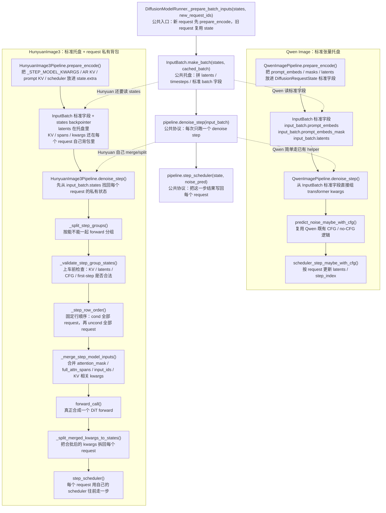
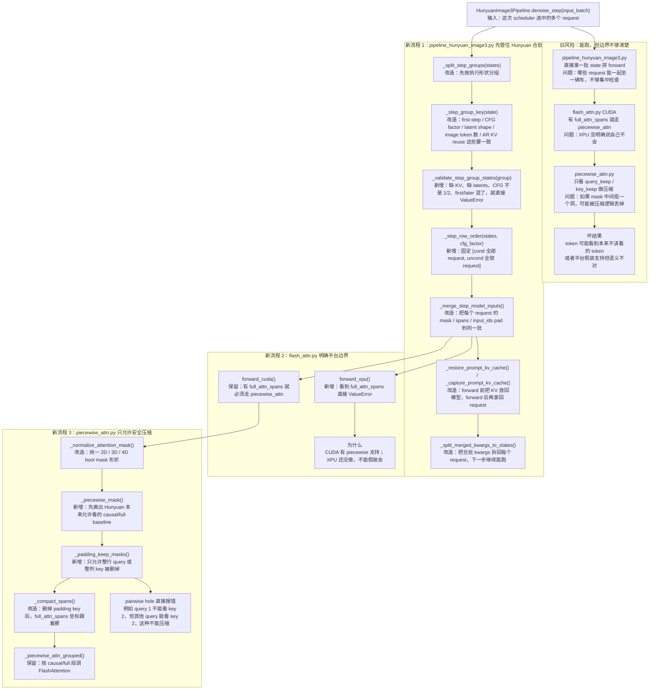

# PR #4041 HunyuanImage3 Group Batch 人话讲解稿

> 这份文档讲 PR #4041 的核心思路。重点不是炫术语，而是说明：为什么 Hunyuan 不能完全照搬 Qwen Image，为什么这些代码要这样拆，哪里必须直接报错。

## 一句话结论

Qwen Image 的 batch 是“标准张量托盘”：prompt embeds、mask、latents 都在 `InputBatch` 标准字段里。Hunyuan 的 batch 是“标准托盘 + request 私有背包”：latents 在 `InputBatch`，但 KV、`full_attn_spans`、model kwargs 还在每个 `DiffusionRequestState.extra` 里，所以 Hunyuan 必须有自己的 merge/split。

换成人话：

- Qwen 像把几份盒饭放进一个托盘，菜、饭、筷子都已经标准化了。
- Hunyuan 像每个人还背着自己的充电宝、钥匙和座位规则。托盘能装饭，但这些私人物品不能乱混。
- 所以 Hunyuan 能学 Qwen 的外层流程，但不能直接复用 Qwen 的内层 denoise 代码。

## 流程图 1：Qwen Image vs Hunyuan 组 batch 差异

这张图要讲清楚一个点：`InputBatch` 对 Qwen 来说基本就是全部；对 Hunyuan 来说只是临时托盘，真正的 KV 和一些 attention 信息还在 request 自己身上。

## 流程图 2：三个大改动文件的旧流程和新流程

这张图的核心是：Hunyuan 这次不是“能拼起来就行”，而是每一步都问一句“这样拼会不会让 request 串状态、CFG 串行、attention 看错 token”。会错的地方就直接报错。

## 代码讲解：每段代码在干嘛、为什么这样写、不这样会怎样

### 1. `pipeline_hunyuan_image3.py`

#### `_step_group_key()`

这段代码在干嘛：

- 给每个 request 算一个“能不能一起 forward”的分组 key。
- key 里包括 first-step 还是 later-step、CFG factor、latent shape、image token 数、AR KV reuse 长度、有没有 AR KV。

为什么这样写：

- 合批不是把所有 request 都塞一起。
- 有些 request 的执行形状不一样，放一起会导致 mask、KV 或 image token 对不上。

不这样会怎样：

- 表面上 tensor 可能还能 cat。
- 但 forward 里面某些 row 的 KV 或 attention span 会按另一种形状解释，结果就是静默错。

#### `_validate_step_group_states()`

这段代码在干嘛：

- 真正上车前做检查。
- 空 group、缺 `_STEP_MODEL_KWARGS`、缺 latents、缺 AR KV、缺 prompt KV、CFG factor 不是 1/2，都会马上报错。

为什么这样写：

- Hunyuan 的 state 比 Qwen 复杂。Qwen 主要看标准 batch 字段，Hunyuan 还要靠 `state.extra` 里的 KV 和 model kwargs。
- 这些东西少一个，后面不是立刻清楚地错，而是可能在 transformer 深处炸，或者更糟，算出错误结果。

不这样会怎样：

- reviewer 看到的是后面某个奇怪 shape error。
- 更坏的是某些缺失字段被默认值吞掉，变成 silent fallback。

人话版本：

> 这一步就是上车验票。没有票、票种不对、路线不一样，都别上车。

#### `_step_row_order()`

这段代码在干嘛：

- 给 CFG 合批固定 row 顺序。
- 顺序是 `[cond req0, cond req1, ..., uncond req0, uncond req1, ...]`。

为什么这样写：

- 后面会用 `pred.chunk(2)` 把模型输出切成 cond 和 uncond 两半。
- 如果 row 顺序不固定，cond/uncond 就会配错 request。

不这样会怎样：

- req0 的 cond 可能拿 req1 的 uncond 做 CFG。
- 这不是性能问题，是生成结果直接错。

人话版本：

> 两摞牌必须摆整齐，后面一刀切成两半才不会乱。

#### `_merge_step_model_inputs()`

这段代码在干嘛：

- 把每个 request 的模型输入合成一个 batch。
- 重点处理 `attention_mask`、`full_attn_spans`、`input_ids` 这些不是简单 cat 就完事的字段。
- later-step 有 prompt KV prefix，不同 request prefix 长度不同，所以要 pad 到同一个最大长度。

为什么这样写：

- Hunyuan 的 prompt KV 是 request 私有的。
- 合批时为了让 transformer 一次 forward，物理 tensor 必须 pad 到同一长度。
- 但是逻辑上每个 request 的 span 还是自己的，所以 `full_attn_spans` 要跟着 prefix padding 平移。

不这样会怎样：

- mask 对齐了但 span 没对齐，token 会看错位置。
- span 对齐了但 mask 没对齐，也会看错位置。

人话版本：

> 桌子要拼成一张大桌，但每个人的座位图也要同步挪过去，不能只挪桌子不挪座位图。

#### `_restore_prompt_kv_cache()` / `_capture_prompt_kv_cache()`

这段代码在干嘛：

- later-step forward 前，把每个 request 自己的 prompt KV 放回模型层里。
- first-step forward 后，把模型新产生的 prompt KV 再抓回来，存回每个 request。

为什么这样写：

- 模型 forward 需要 KV 在 layer 的 attention manager 上。
- 但 request 之间不能共享这些 KV。
- 所以 forward 前临时装进去，forward 后拆回来。

不这样会怎样：

- req0 可能用到 req1 的 prompt KV。
- 或者下一步 request 找不到自己的 KV。

人话版本：

> KV 是每个 request 自己的钥匙。进门前把钥匙交给模型，用完再还给本人，不能放公共抽屉里混。

#### `_split_merged_kwargs_to_states()`

这段代码在干嘛：

- forward 后，模型更新出来的 kwargs 是 batch 形态。
- 这段代码按 row 顺序把它拆回每个 request。
- 对 later-step 的 `attention_mask`，还要把为了合批加进去的 max-prefix padding 去掉，恢复 request-local 形状。

为什么这样写：

- 下一步 denoise 还是以每个 request 的 state 为源头。
- 如果不拆回去，下一轮就不知道每个 request 自己的 mask、KV lens、span 是什么。

不这样会怎样：

- 第一步可能过，第二步开始状态就混了。
- 这类 bug 很难从最后图片看出来，只会表现成质量差或偶发 shape 错。

#### `denoise_step()`

这段代码在干嘛：

- 这是 Hunyuan step execution 的总控。
- 它从 `input_batch.states` 拿 request，分组，逐组 `_denoise_step_group()`，最后按原 request 顺序拼回输出。

为什么这样写：

- scheduler 要的是“这一批 request 的 noise_pred，顺序要和 input_batch 一致”。
- 但 Hunyuan 内部可能会把 request 拆成多个兼容 group 跑。
- 所以内部怎么分组都可以，返回时必须按原顺序。

不这样会怎样：

- scheduler 可能把 req1 的 noise_pred 写进 req0。
- 这就是 request 串结果。

### 2. `flash_attn.py`

#### `forward_cuda()`

这段代码在干嘛：

- CUDA/ROCm/MUSA 上，如果 `attn_metadata.full_attn_spans` 存在，就走 `piecewise_attn()`。
- 因为这说明当前 attention 不是纯 causal，也不是纯 full，而是 mixed causal/full。

为什么这样写：

- Hunyuan 的某些 token 要 full attention，其他 token 还是 causal。
- 普通 FlashAttention 一次调用只有一个 causal 开关，不够表达这种混合规则。
- `piecewise_attn()` 会把序列切段，每段用正确的 causal 设置调 FA。

不这样会怎样：

- 要么全部按 causal 算，full span 不生效。
- 要么全部按 full 算，token 看到了未来信息。

#### `forward_xpu()`

这段代码在干嘛：

- XPU 路径看到 `full_attn_spans` 直接 `ValueError`。

为什么这样写：

- XPU 这条路径现在还没有实现 piecewise mixed causal/full attention。
- 不支持就要明说。

不这样会怎样：

- 用户以为 XPU 支持 Hunyuan 的 mixed attention。
- 实际可能丢掉 `full_attn_spans`，结果悄悄算错。

人话版本：

> 不会就说不会，不能假装会。

### 3. `piecewise_attn.py`

#### `build_segments()`

这段代码在干嘛：

- 把 query 序列切成一段一段。
- 普通段是 causal。
- `full_attn_spans` 命中的段是 full。

为什么这样写：

- FlashAttention 一次调用只能选 causal 或非 causal。
- mixed attention 只能拆成多个 segment 分别算。

不这样会怎样：

- 没法表达“有些 token full，有些 token causal”的规则。

#### `_piecewise_mask()`

这段代码在干嘛：

- 根据 `full_attn_spans` 画出 baseline mask。
- baseline 的意思是：不考虑 padding 时，Hunyuan 本来允许哪些 query 看哪些 key。

为什么这样写：

- 后面要判断用户传进来的 `attention_mask` 是不是只是 padding。
- 判断之前必须先知道“正常规则”长什么样。

不这样会怎样：

- 会把 causal/full 本来就存在的洞误判成非法。
- 或者把真正非法的 pairwise hole 放过去。

#### `_padding_keep_masks()`

这段代码在干嘛：

- 检查 mask 只能删除整行 query 或整列 key。
- 如果 mask 在中间抠一个洞，比如 query 1 不看 key 2，但其他 query 还能看 key 2，就直接报错。

为什么这样写：

- 这条 FA 路径的优化方式是 compact：删掉无效 query/key 后再算。
- compact 只能安全表达 padding。
- 它不能表达任意 pairwise hole。

不这样会怎样：

- 原 mask 说 query 1 不能看 key 2。
- compact 后 mask 被丢掉，query 1 又看到了 key 2。
- 这就是 token 看到了本来不该看的 token。

人话版本：

> 整行整列删可以；中间抠洞不行。

#### `_compact_spans()`

这段代码在干嘛：

- key 被 padding 压缩后，原来的 span 坐标也要跟着变。

为什么这样写：

- `full_attn_spans` 是按 key/global position 表示的。
- 如果 key 列删掉了，旧坐标已经不对应 compact 后的 tensor。

不这样会怎样：

- full attention 段会落到错误位置。

#### `piecewise_attn()`

这段代码在干嘛：

- 总控流程：
  1. 没 mask：直接按 segments 调 `_piecewise_attn_grouped()`。
  2. 有 mask：先 normalize 成统一形状。
  3. 每一行先建 baseline。
  4. 检查 mask 只能是 padding。
  5. compact query/key/span。
  6. 调 `_piecewise_attn_grouped()`。
  7. 把结果 scatter 回原 query 位置。

为什么这样写：

- Hunyuan 需要保住 mixed causal/full 语义。
- 同时还要支持 padding，否则不同 prompt length 没法合批走 FA。
- 但不能支持任意 mask，因为那会算错。

不这样会怎样：

- 不支持 padding：合批能力弱。
- 乱支持任意 mask：结果可能错而且不报错。

## 5-10 分钟台词本：照着讲版

### 0:00-0:45 开场：这个 PR 到底干什么

这个 PR 不是给 Hunyuan 随便乱塞 batch。它做的是：在 DiT denoise step 这一层，把多个 request 合成一次 forward。

为什么是 denoise step？因为每个 request 的 prompt encode、scheduler、KV 状态都可以先各自准备好。真正重的地方是 DiT forward，所以我们只在这个地方合批。

一句话：外面还是每个 request 自己管理状态，里面 DiT forward 尽量一起算。

### 0:45-2:00 Qwen 和 Hunyuan 最大差异

Qwen Image 比较干净。它的 prompt embeds、prompt mask、latents 都能放进 `InputBatch` 的标准字段里。到了 `denoise_step()`，Qwen 直接从 `input_batch.prompt_embeds`、`input_batch.prompt_embeds_mask`、`input_batch.latents` 组 kwargs，然后复用 `predict_noise_maybe_with_cfg()`。

Hunyuan 不一样。Hunyuan 除了 latents，还有 AR KV、prompt KV、`full_attn_spans`、attention mask、position 相关 kwargs。这些东西不是普通张量托盘能完全表达的，它们属于每个 request 自己的私有状态。

所以我们只学 Qwen 的外层形状：runner 选一批 request，`InputBatch.make_batch()` 做临时托盘，`denoise_step()` 跑一步，`step_scheduler()` 写回 request。内层 merge/split 必须 Hunyuan 自己做。

### 2:00-3:30 Hunyuan 怎么安全合批

Hunyuan 的合批分三步：先分组，再检查，再合并。

第一步 `_split_step_groups()`。不是所有 request 都能坐一辆车。first-step 和 later-step 不能混，CFG factor 不能混，latent shape 不能乱，AR KV reuse 形状也要一致。

第二步 `_validate_step_group_states()`。这一步就是上车验票。缺 latents、缺 model kwargs、first-step 缺 AR KV、later-step 缺 prompt KV，直接报错。不要等到 transformer 里面炸。

第三步 `_step_row_order()` 和 `_merge_step_model_inputs()`。CFG 的 row 顺序固定成 cond 全部 request，然后 uncond 全部 request。这样后面 `pred.chunk(2)` 才不会把 req0 的 cond 和 req1 的 uncond 配到一起。

合并输入时，attention mask 和 full attention spans 必须一起移动。不能只 pad tensor，不移动 span 坐标。

### 3:30-5:30 为什么 attention 这里这么严

Hunyuan 的 attention 不是简单 causal，也不是简单 full。它是混合的：普通 token 按 causal，看前面；某些 span 里的 token 可以 full attention。

这就是 `full_attn_spans` 的作用。

CUDA FlashAttention 一次调用只有一个 causal 开关，所以我们用 `piecewise_attn()` 把序列切成几段。causal 段按 causal 调 FA，full 段按 non-causal 调 FA。

问题来了：batch 里不同 prompt length 要 padding。padding 可以压缩，比如删掉整列 key 或整行 query，这没问题。

但如果 mask 在中间抠一个洞，比如 query 1 不能看 key 2，其他 query 又能看 key 2，这种不能压缩。因为压缩后原始 mask 丢了，query 1 可能重新看到 key 2。

所以 `_piecewise_mask()` 先画出 Hunyuan 本来允许看的 baseline。`_padding_keep_masks()` 再检查传进来的 mask 是不是只删 padding 行列。不是，就直接报错。

人话就是：整行整列删可以，中间挖洞不行。

### 5:30-6:30 XPU 为什么直接报错

CUDA 路径现在有 `piecewise_attn()`，所以可以处理 `full_attn_spans`。

XPU 还没有这套实现。如果 XPU 看到 `full_attn_spans` 还继续往下跑，就可能假装支持 mixed causal/full attention，实际把语义丢了。

所以 `forward_xpu()` 看到 `full_attn_spans` 直接报错。

这不是保守过头。不会就说不会，比静默算错强。

### 6:30-7:30 为什么 forward 后还要拆回 request

合批只发生在这一轮 forward。forward 完以后，每个 request 的状态还是要自己继续走。

所以 `_split_merged_kwargs_to_states()` 要把 batch 形态的 kwargs 拆回每个 request。prompt KV 也一样，模型里只是临时挂一下，用完要还给 request。

如果不拆回去，下一步 denoise 就不知道每个 request 自己的 mask、span、KV lens 是什么。第一步可能没事，第二步就乱了。

### 7:30-8:30 测试和边界

这次测试重点不是只看 tensor 能不能 cat。真正要测的是状态有没有串。

需要覆盖三类：

- `InputBatch.states` cache-hit 会刷新，否则 Hunyuan 可能拿旧 request state。
- `piecewise_attn` 遇到 pairwise hole 会 raise，否则 token 会看到不该看的 token。
- Hunyuan group path 要真的走 `InputBatch.make_batch -> denoise_step -> _denoise_step_group -> split back`，确认输出按原 request 顺序回来。

现在边界也要讲清楚：SP、CFG parallel、cache backend、KV skip、image edit 这些没证明的路径继续不支持。不是永远不能做，是这个 PR 不冒险做。

## 最后给 reviewer 的一句话

这个 PR 的核心不是“把 batch 做大”，而是“在不会串 request 状态、不会串 CFG 行、不会让 token 看错 mask 的前提下，把 Hunyuan DiT denoise forward 合起来”。Qwen 提供的是外层流程参考，Hunyuan 的 KV、span、mask 决定了它必须有自己的 merge/split。
