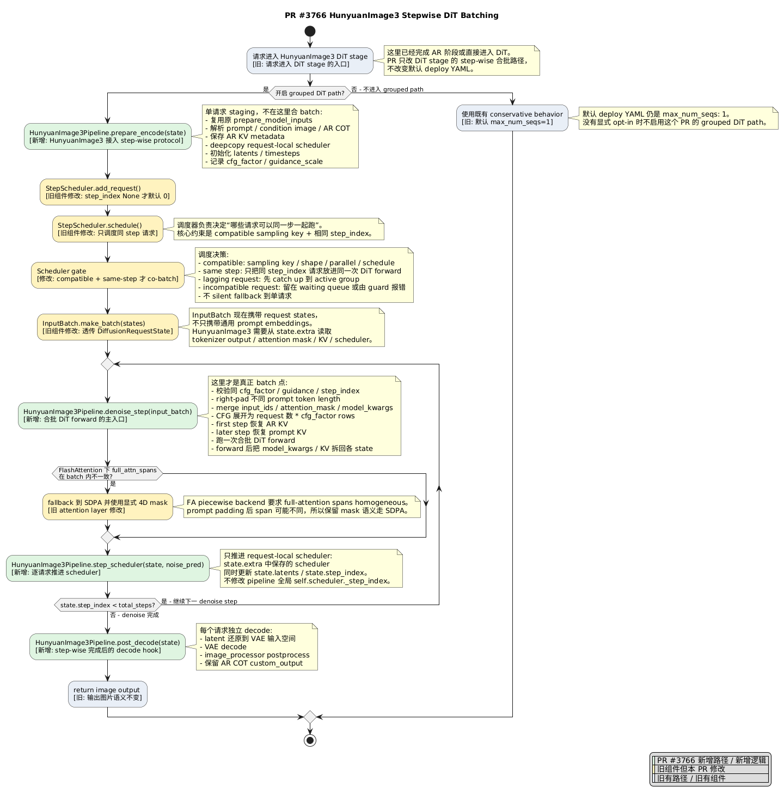
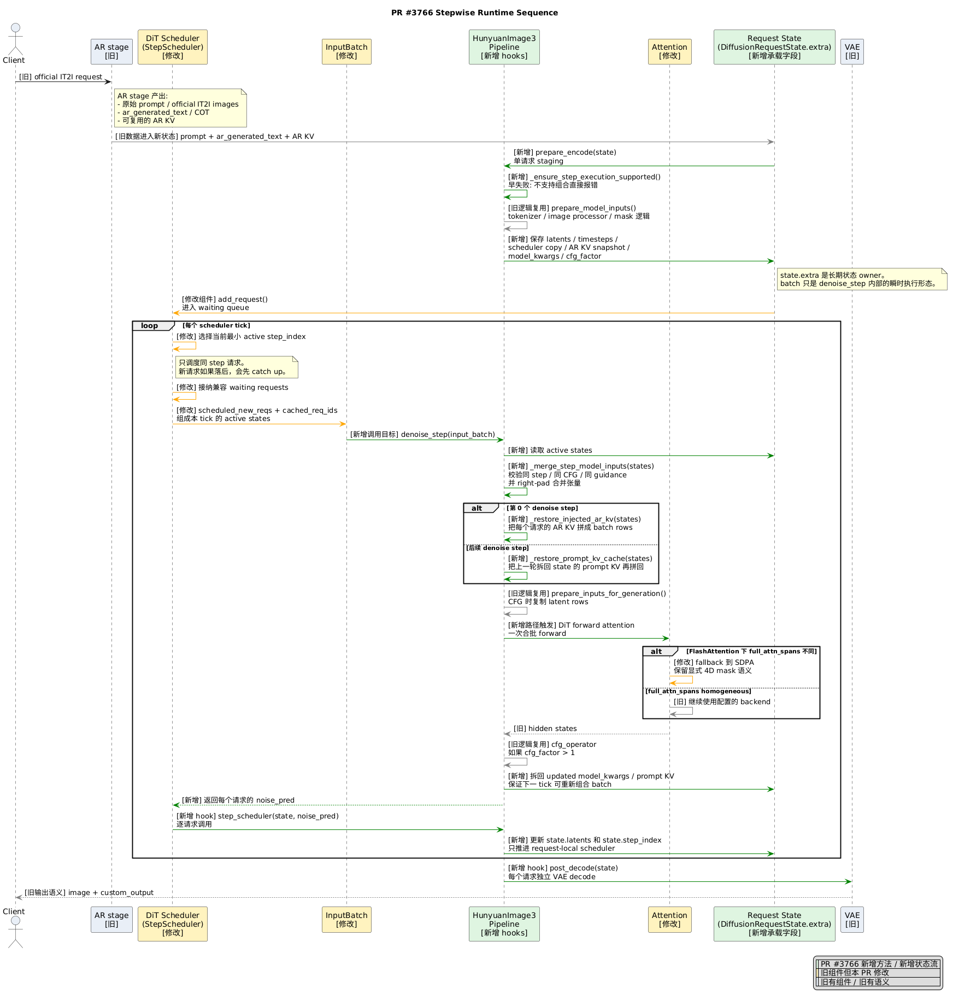

# PR #3766 HunyuanImage3 Stepwise DiT Batching 流程图讲解

来源：[`vllm-project/vllm-omni#3766`](https://github.com/vllm-project/vllm-omni/pull/3766)
源码版本：PR head `c6c50b5fac6dc52e8030dfb5d8ddc2b5530f7c1f`

## 先说人话

旧逻辑可以理解成：一个请求进 DiT 后，自己从第 0 步 denoise 一路跑到最后，中间没有机会和别的请求合并跑。

PR #3766 做的事是：把 HunyuanImage3 DiT 改成“每一步都交给 scheduler 调度”。scheduler 每次只挑同一 denoise step、参数兼容的请求，把它们临时拼成一个 DiT batch 跑一次 forward。跑完后再把结果拆回每个请求自己的状态里。

关键点只有三个：

1. **请求状态不能混**：每个请求自己的 scheduler、latents、KV cache 都放在自己的 `DiffusionRequestState.extra` 里。
2. **只合并同一步**：step 3 的请求不能和 step 7 的请求塞进同一个 DiT forward。
3. **batch 只是临时的**：真正长期保存的是每个 request state，DiT forward 前临时 merge，forward 后立刻 split 回去。

## 图例

- 绿色：PR #3766 新增路径 / 新增 hook。
- 黄色：旧组件，但这个 PR 改了它。
- 灰色：旧路径 / 旧语义。

## 总流程图



## 时序图



## 按一条请求从头讲到尾

### 1. 请求先到 AR，再进 DiT

用户发一个 IT2I 请求。AR stage 先处理 prompt、图片和 COT，必要时还会产出可以给 DiT 复用的 AR KV。

这部分不是 PR #3766 的重点。图里把它标成旧逻辑。

### 2. DiT 不再“一口气跑完”，而是先做 staging

进入 DiT 后，新增的 `prepare_encode(state)` 会把这个请求拆成一个可逐步执行的 state。

它会准备这些东西：

- prompt 和 condition image 的模型输入
- 初始 latents
- timesteps
- request 自己的 scheduler copy
- CFG 信息
- AR KV snapshot
- 后续 DiT forward 需要的 `model_kwargs`

这里还没有 batch。这里的意思是：“先把每个请求自己的家当收拾好，放进自己的 state 里。”

### 3. scheduler 决定谁能一起跑

`StepScheduler.schedule()` 每个 tick 做一次调度。

它不能随便把请求凑一起。能一起跑必须满足：

- 采样参数兼容
- shape / 分辨率兼容
- 并行配置兼容
- denoise schedule 兼容
- 当前 `step_index` 一样

如果新请求落后，就先让它 catch up。不能把 step 3 和 step 7 混跑。

### 4. InputBatch 把 request state 传进 pipeline

HunyuanImage3 DiT 不是只靠 `prompt_embeds + latents` 就能跑。它还需要 attention mask、tokenizer output、AR KV、prompt KV、scheduler 等信息。

所以 PR 修改了 `InputBatch`，让它带上 `states`。这样 `denoise_step(input_batch)` 才能读到每个请求完整的状态。

### 5. KVC 现在怎么接进 step-wise

这里不是重新发明一套 KVC。底层还是复用 HunyuanImage3 原来的 KV cache / KV reuse 机制；这个 PR 新做的是把 KV 的生命周期搬进 request state，保证 step-wise batching 下不会串请求。

它分两段：

1. **AR -> DiT 的 KV reuse**
   AR stage 把 KV 放到 sampling 里传给 DiT。`prepare_encode(state)` 会先把这份 AR KV 喂给既有的 `_maybe_handle_ar_kv_reuse(...)`，让老逻辑完成 KV 注入判断。然后 PR 新增 `_snapshot_injected_ar_kv(clear=True)`，把每层临时挂在 layer 上的 AR KV 抄到当前 `state.extra["ar_kv_reuse"]`，并清掉 layer 上的临时值。

2. **DiT 内部 prompt KV cache**
   第 0 个 denoise step forward 后，DiT 会产生 prompt KV。PR 新增 `_capture_prompt_kv_cache(...)`，把合批后的 KV 按 request 拆开，存回每个 `state.extra["prompt_kv_cache"]`。后续 denoise step 前，再用 `_restore_prompt_kv_cache(...)` 按当前 active batch 重新拼回 layer。

所以回答“是不是复用了”：**是，底层 KV reuse / ImageKVCacheManager 逻辑复用；但为了 step-wise grouped batching，PR 新增了 snapshot、restore、capture、split 回 state 这一层胶水。**

这也是为什么不能只在 pipeline 全局对象上放 KV。continuous batching 下第 1 步和你同批的请求，到了第 10 步可能换了。KV 必须属于 request 自己，而不是属于某一次 batch。

### 6. `denoise_step` 是 step-wise runtime 的单步执行 hook

这里说“新增 `denoise_step`”，不是说新增了一套 denoise 算法。原来 HunyuanImage3 的 DiT path 是在 pipeline 里面自己跑完整 denoise loop；PR #3766 是把这个 loop 拆开，让 runtime 每个 scheduler tick 调一次 `denoise_step(input_batch)`。

所以 `denoise_step` 的含义是：**当前 tick 里，拿 scheduler 选中的 active requests，只跑一个 DiT denoise step。**

`denoise_step(input_batch)` 会：

1. 从 `input_batch.states` 读出本轮 active requests。
2. 检查它们是不是同 step、同 CFG 模式、同 guidance。
3. 不同 prompt token length 的字段做 right padding。
4. 把 `input_ids`、`attention_mask`、`model_kwargs` 拼成一个 batch。
5. 如果开 CFG，把 batch rows 变成 `请求数 * cfg_factor`。
6. first step 恢复 AR KV；后续 step 恢复 prompt KV。
7. 跑一次合批 DiT forward。
8. 把新的 `model_kwargs` 和 KV cache 拆回每个 request state。

一句话：**这里把多个请求临时拼起来跑，跑完马上拆开。**

### 7. 每个请求各自推进 scheduler

DiT forward 返回的是 noise prediction。之后 `step_scheduler(state, noise_pred)` 对每个请求单独调用。

它只更新这个请求自己的：

- `state.latents`
- `state.step_index`
- `state.extra` 里的 scheduler

它不改 pipeline 全局 scheduler。这样不同请求就不会互相串 step。

### 8. denoise 完成后各自 decode

所有 denoise step 跑完后，`post_decode(state)` 把当前请求的 latents 送进 VAE decode，再做 image postprocess，最后返回图片。

decode 仍然是每个请求自己的输出语义，不因为中间合 batch 改变。

## 这次到底改了哪些源码

| 文件 | 这次改了什么 | 看代码时先看哪里 |
| --- | --- | --- |
| `vllm_omni/diffusion/models/hunyuan_image3/pipeline_hunyuan_image3.py` | HunyuanImage3 接入 step-wise protocol；新增 staging、合批 denoise、逐请求 scheduler、decode hook | `supports_step_execution`、`prepare_encode`、`denoise_step`、`step_scheduler`、`post_decode` |
| `vllm_omni/diffusion/sched/step_scheduler.py` | scheduler 不再无脑调度 running requests，而是只选同一个 step 的请求 | `schedule()` |
| `vllm_omni/diffusion/worker/input_batch.py` | `InputBatch` 增加 `states`，让 pipeline 能读 request-local 状态 | `InputBatch.states`、`make_batch()` |
| `vllm_omni/diffusion/attention/layer.py` | full-attention spans 不一致时，FlashAttention fallback 到 SDPA | `_has_nonhomogeneous_full_attn_spans()` 和 fallback 分支 |
| `tests/diffusion/models/hunyuan_image3/test_hunyuan_image3_step_execution.py` | 覆盖 HunyuanImage3 step execution 的关键边界 | padding、KV restore、scheduler dtype、unsupported cases |
| `tests/diffusion/models/hunyuan_image3/test_image_kv_cache_manager.py` | 覆盖底层 prompt KV cache / AR KV reuse 行为 | `_cache_prompt_kv()`、`_reuse_prompt_kv()`、`image_kv_cache_map` |

## 最小源码入口

只需要抓住这几个入口，其他细节可以顺着调用链往下追：

```python
supports_step_execution: ClassVar[bool] = True
```

```python
def prepare_encode(self, state, **kwargs):
    # 单请求 staging：准备 latents / timesteps / scheduler copy / KV / model_kwargs
```

```python
def denoise_step(self, input_batch, **kwargs):
    # 真正合 batch：merge states -> DiT forward -> split back to states
```

```python
def _restore_injected_ar_kv(self, states, cfg_factor):
    # first step 前，把每个 state 里的 AR KV 重新拼回 layer
```

```python
def _capture_prompt_kv_cache(self, states, cfg_factor):
    # first step 后，把合批 prompt KV 拆回每个 state
```

```python
def _restore_prompt_kv_cache(self, states, cfg_factor):
    # later step 前，把各 state 的 prompt KV 按当前 batch 重新拼回 layer
```

```python
def step_scheduler(self, state, noise_pred, **kwargs):
    # 逐请求推进 request-local scheduler，不动全局 scheduler
```

```python
def schedule(self):
    # 只调度当前最小 step_index 的 running requests
```

## 为什么不能简单说“两个请求一起跑，所以 2x”

因为 HunyuanImage3 开 CFG 时，一个请求本来就会变成两条 DiT row：

```text
effective_dit_rows = num_requests * cfg_factor
cfg_factor = 1 if guidance_scale <= 1 else 2
```

`guidance_scale=2.5`、`max_num_seqs=2` 时，每个 denoise step 实际是 `2 requests * 2 CFG rows = 4 rows`。

所以这个 PR 的价值不是“性能直接翻倍”，而是先把 HunyuanImage3 DiT 从不能 grouped batching，打通到可以按 step grouped batching。PR body 里的官方 IT2I e2e speedup 是 `1.036x`，DiT-only smoke speedup 是 `1.098x`。

## 最后怎么讲

可以直接这样讲：

> 这个 PR 把 HunyuanImage3 DiT 从 request-mode 的整段 denoise，改成 step-wise 调度。每个请求先在 `prepare_encode` 里保存自己的 scheduler、latents、KV 和 model kwargs；scheduler 每次只挑同 step 且兼容的请求；`denoise_step` 临时 merge 成一个 DiT batch 跑 forward；跑完后再 split 回每个 request state；最后每个请求各自 scheduler step 和 decode。这样 batch 不污染请求状态，也不会把不同 denoise step 混在一起。
